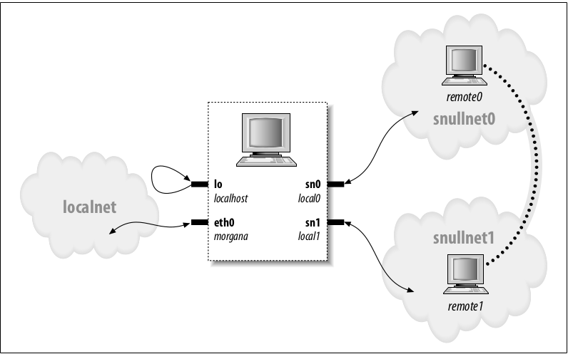

## What is an OS ?

Before diving in kernel, we should understand, what OS is? as Kernel is one of the part of OS.

- Operating system is basically a Resource Manager. Some resources that are managed by OS are [processor, main memory, secondary memory, devices and information].
- While managing these resources issues like privacy, Efficiency, Reliability, Protection and security is a concern of OS.

## What is a kernel ?

- The kernel is one of the part of OS. The ❤️ of OS is called kernel.
- Its is responsible for the sw and hw of our computer to work correctly and make sure they interact with each other.
- It load firstly & remain in MM, so that memory accessibility can be managed for the programs within the RAM.

## Kernel Functions

- Manage Ram.
- Manage Processor time, which is used by the running process.
- Manage Access and use of peripherals attached to computer.

Linux kernel can be updated without affecting the rest of Operating system.

## What is atomic Context? 

Kernel code generally runs in one of two fundamental contexts. Process context reigns when the kernel is running directly on behalf of a (usually) user-space process; the code which implements system calls is one example. When the kernel is running in process context, it is allowed to go to sleep if necessary. But when the kernel is running in atomic context, things like sleeping are not allowed. Code which handles hardware and software interrupts is one obvious example of atomic context. 

There is more to it than that, though: any kernel function moves into atomic context the moment it acquires a spinlock. Given the way spinlocks are implemented, going to sleep while holding one would be a fatal error; if some other kernel function tried to acquire the same lock, the system would almost certainly deadlock forever. 

## What is Spin Lock ? 

Example: Lets suppose we have to perform 3 operation on an item namely: GetItem(id), Increment(Item),SaveItem(Item). If two request are made with the same ID on a same time then this is the concurrency iusse, as one should complete all three operation inorder before some other element try to change it. So inorder to mitigate concurrency iusse we have the concept of locks. The first request will make a lock on that resource so that no one can intreupt in between when the job is completed it unclocks the resource. Now the other Request will acquire the lock and complete it task. When Request A is busy doing its work on meanwhile Request B keeps trying to aquire that resource and spins until it gets the resource. 

A great video to watch in order to understand spinlock: 
https://www.youtube.com/watch?v=cEcNLfXEaZs

## Steps to configure Question 5

- Check network IP by ifconfig. Let's instance it's eno1: 10.2.16.239

- Add two networks in ~/etc/networks
    - snullnet0 10.2.16.0
    - snullnet1 10.2.17.0

- Add Host in ~/etc/hosts
    
    - 10.2.16.1     local0
    - 10.2.16.2     remote0   
    - 10.2.17.2     local1
    - 10.2.17.1     remote1

- Make sure the module snull is inserted into the kernel.

- As IP is not of class C so we have to add netmask.
   - sudo ifconfig sn0 local0 netmask 255.255.255.0
   - sudo ifconfig sn1 local1 netmask 255.255.255.0

- Check connection by Ping from host(your-PC) to virtual host(remote0/remote1). (Optional)
    - sudo ping -c 2 remote0
    - sudo ping -c 2 remote1

- To make Loopback interface down
    - ifconfig lo down

- Ping both virtual host with one another.
    - sudo ping -I sn0 10.2.17.1
    - sudo ping -I sn1 10.2.16.2

References-Question6:
 - Linux device drive by Jonathan Chapter#17.
 - Slideshare: https://ufal.mff.cuni.cz/~jernej/2018/docs/predavanja15.pdf
 - Snull Driver Module: https://github.com/martinezjavier/ldd3/blob/master/snull/snull.c